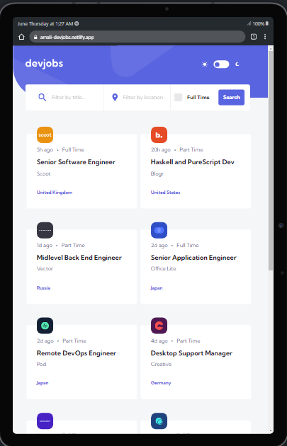
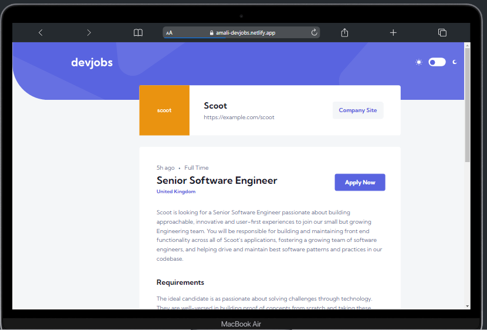
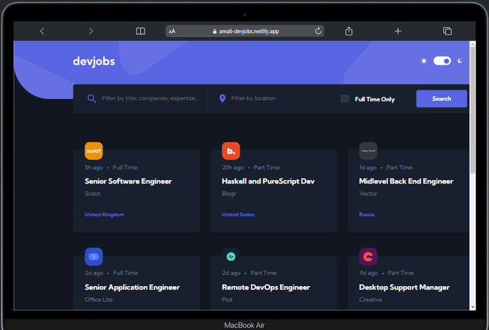
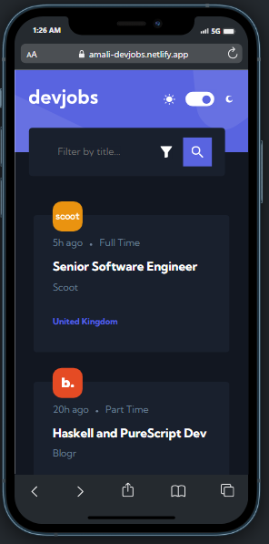

# 

# Devjobs web app

> A job board for developers showing job vacancies to job seekers. Users can search and apply for new job opportunities in their area and profession.
>
> #### Visit site to Check live demo [_here_](https://dev-jobs-job-search-website.vercel.app/).


# Description

A job board for employers to promote job vacancies to job seekers. Job seekers can search for new job opportunities in their area and profession, read about the position and be directed to the employer’s application website.

---

# Technologies Used

### engines

- node: ">=6.0.0"

The Project is created with:

- vite: "^4.3.2"
- react: "^18.2.0"
- react-dom: "^18.2.0"
- react-router-dom: "^6.11.2"
- Javascript
- CSS

---

# Features

- Responsive :

  - Adapts to devices of all sizes from mobile to desktop

- browser compatible:

  - fully functional on all modern browsers such as Google Chrome , Edge

- users can filter data to their requirements

- Details page to read more about a position

- Dark mode

---

# Screenshots



### dark mode

---



---

### mobile

---



---

[Back To The Top](#devjobs-web-app)

# Setup

To clone and run this application, you'll need to first have Git and Node.js (npm) installed on your computer. From your command line type the following:

## Clone this repository

$ git clone https://github.com/backpackerdeveloper/DevJobs---Job-Search-Website.git

## Go into the repository

$ cd ./DevJobs---Job-Search-Website

## Install dependencies

$ npm install

## Run the app

$ npm run dev

```
$ cd ./devjobs
$ npm install
$ npm run dev
```

---

# How To Use

## References

### Back-end

---

` server/API to get the project data`:

```javascript
const serverUrl = https://server-devjobs.onrender.com
```

The data of the project is hosted on this server [VISIT SERVER](https://server-devjobs.onrender.com) which provides different API's to served various data to the front-end.
The server is built using the following technologies:

- node js
- express
- json data

## API Reference

```javascript
// get all data from API
const getAllData = fetch(`https://server-devjobs.onrender.com/`);

// get all data which match specific location from API
const specificLocationData = fetch(
  `https://server-devjobs.onrender.com/locations/locationName`
);
// get all data that includes certain keywords from API
const certainCategoryData = fetch(
  `https://server-devjobs.onrender.com/category/categoryName`
);
```

